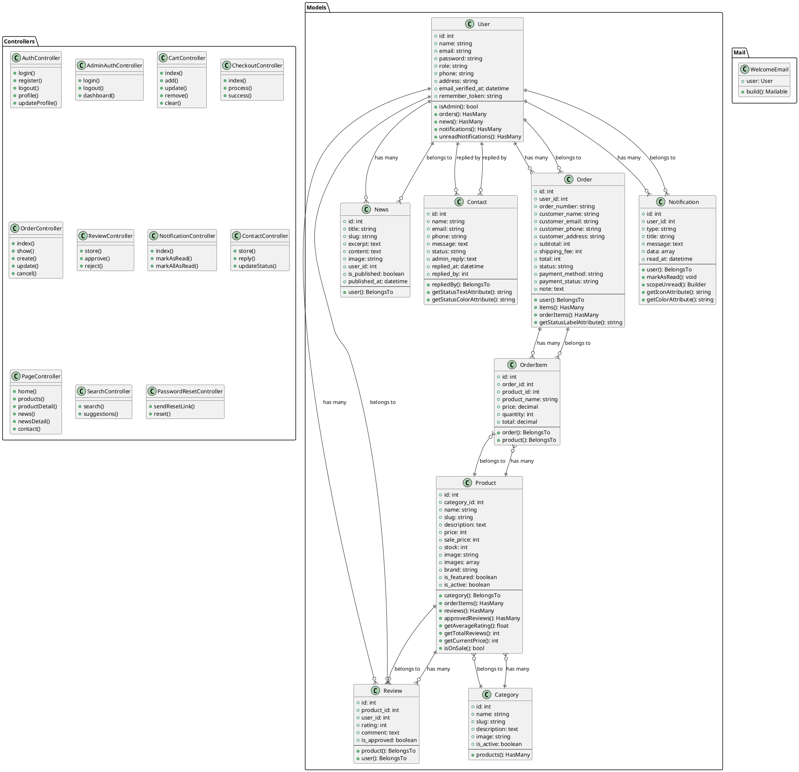

# Biểu đồ Class Tổng quát - Hệ thống E-commerce Laravel

## Mô tả hệ thống
Đây là hệ thống thương mại điện tử được xây dựng bằng Laravel với các chức năng chính:
- Quản lý sản phẩm và danh mục
- Hệ thống đặt hàng và thanh toán
- Quản lý người dùng và phân quyền
- Hệ thống đánh giá sản phẩm
- Quản lý tin tức và thông báo
- Hệ thống liên hệ

## Biểu đồ Class (PlantUML)

## Mô tả các thành phần chính

### 1. User Management
- **User**: Quản lý thông tin người dùng, phân quyền admin/customer
- **AuthController**: Xử lý đăng nhập, đăng ký, quản lý profile
- **AdminAuthController**: Xử lý đăng nhập admin riêng biệt

### 2. Product Management
- **Category**: Danh mục sản phẩm với slug và trạng thái
- **Product**: Sản phẩm với thông tin chi tiết, giá, kho, hình ảnh
- **Review**: Đánh giá sản phẩm từ khách hàng

### 3. Order Management
- **Order**: Đơn hàng với thông tin khách hàng và trạng thái
- **OrderItem**: Chi tiết sản phẩm trong đơn hàng
- **CartController**: Quản lý giỏ hàng
- **CheckoutController**: Xử lý thanh toán

### 4. Communication
- **News**: Tin tức và bài viết
- **Contact**: Liên hệ từ khách hàng
- **Notification**: Thông báo hệ thống
- **WelcomeEmail**: Email chào mừng

### 5. Support Features
- **SearchController**: Tìm kiếm sản phẩm
- **PasswordResetController**: Đặt lại mật khẩu
- **PageController**: Các trang chính của website

## Mối quan hệ chính
1. **User** có nhiều **Order**, **Review**, **News**, **Notification**
2. **Category** có nhiều **Product**
3. **Product** thuộc về **Category**, có nhiều **OrderItem** và **Review**
4. **Order** thuộc về **User** và có nhiều **OrderItem**
5. **OrderItem** liên kết **Order** và **Product**

## Đặc điểm kỹ thuật
- Sử dụng Laravel Eloquent ORM cho các mối quan hệ
- Tự động tạo slug cho Category, Product, News
- Hệ thống phân quyền đơn giản (admin/user)
- Quản lý trạng thái đơn hàng và thanh toán
- Hệ thống thông báo với nhiều loại khác nhau